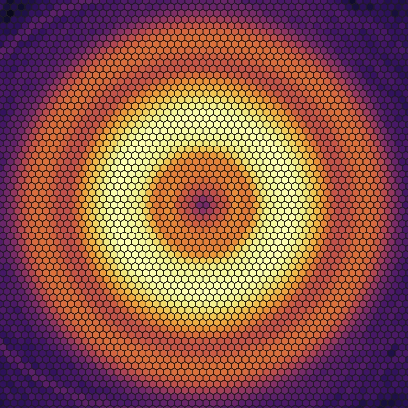
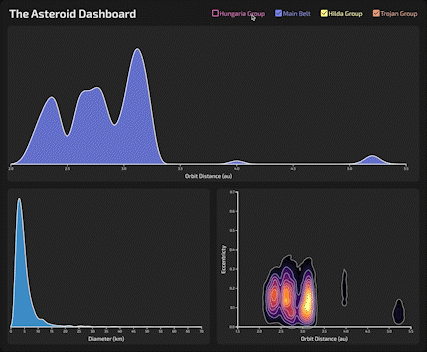

<div align='center'></div>
<h1 align='center'>sbmap</h1>

The comprehensive Small Body Map for the Average Person (SBMAP), aims to provide a digestible, holistic representation of our solar system's many small bodies without sacrificing detail or accuracy.

Data Processing done using:

- Python ([Pandas](https://pandas.pydata.org), [Matplotlib](https://matplotlib.org/stable/index.html#), [Multiprocessing](https://docs.python.org/3/library/multiprocessing.html))
- JavaScript ([Stratify](https://github.com/cpl-cs360/sbmap/blob/main/data/dashboard/Stratify.ts))

## Deployment

Find the live deployment at [https://cpl-cs360.github.io/sbmap/](https://cpl-cs360.github.io/sbmap/)

Performance is optimized for Opera and Firefox with resolution higher than 1280x800


# User Manual

>Please note that for the best experience, I highly suggest using **[Opera](https://www.opera.com/download)**.

## Basic Use

### The Birds Eye View

Hover for `0.5s` to reveal **the number** of asteroids that intersect the current hex.


Hover for `1s` to reveal **the orbital paths** of asteroids that intersect the current hex.


### The Dashboard

Click the group name or checkbox to **toggle** their presence.



---

## For Developers:

### Installation

1. Install and use the correct version of node using [NVM](https://github.com/nvm-sh/nvm)'s
    `nvm install` and `nvm use`

2. Install dependencies
    ```sh
    npm i
    ```

3. Start the development server
    ```sh
    npm run dev
    ```

### Building and Running for Production

1. Generate a full static production build

   ```sh
   npm run build
   ```

2. Preview the site as it will appear once deployed

   ```sh
   npm run preview
   ```

### The Tech Stack

#### Dependencies
- [Material Icons](https://mui.com/material-ui/material-icons/)
- [D3](https://d3js.org)
- [d3-interpolate-path](https://github.com/pbeshai/d3-interpolate-path)
- [d3-svg-legend](https://d3-legend.susielu.com)
- [React](https://reactjs.org)
- [react-scrollama](https://github.com/jsonkao/react-scrollama)
- [react-spinners](https://github.com/davidhu2000/react-spinners)
- [Sass](https://sass-lang.com)

#### Dev Dependencies

- [Typescript](https://www.typescriptlang.org)
- [Vite](https://vitejs.dev)
